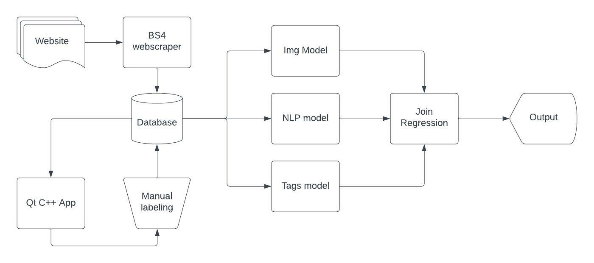
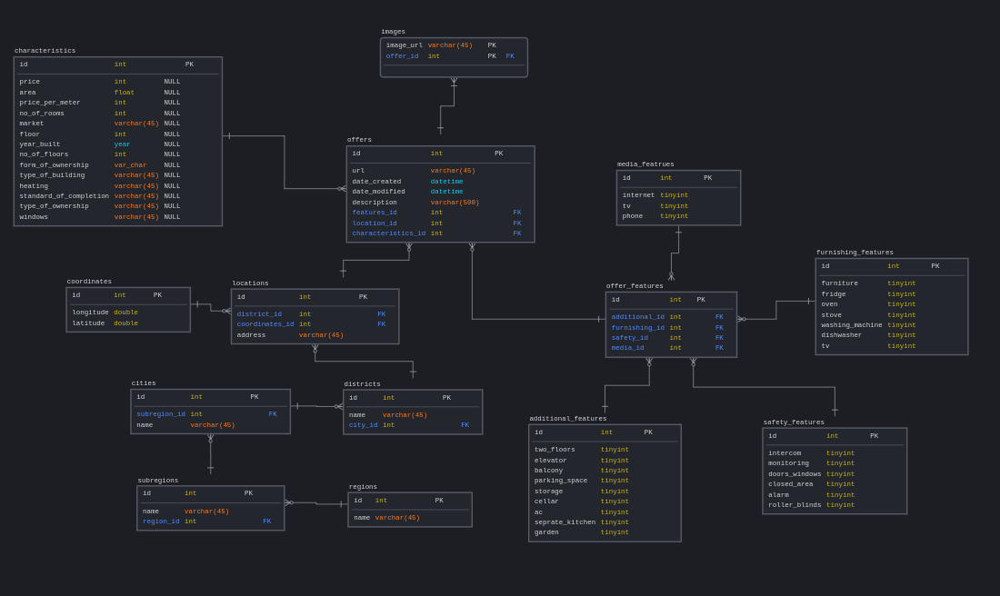

# Idea behind the project
For quite some time I have been searching for an affordable apartment in Warsaw.
Even though I cannot currently afford one I'm still invested in the market because I dream
of having my own place in the future.
  
It has occured to me that some of the offers are just straight terrible. 
The builidng looks like a ruin, the location is suboptimal, there are no photos 
of the place or there are only renders of what the place could look like.  
  
So an idea for a project sparked in my head. Perhaps I could write a program that
scrapes the web for offers, extracts information out of it (like the pictures,
description, etc.) and uses ML models to decide if I would like it or not.  
  
I honestly doubt that it will work, but I want to try anyway and I'll probably learn
a lot while doing it.
  
This README will serve as a sort of log of my progress so far.

# The structure
The basic structure is as follows:
- A webscraper that uses BeautifulSoup extracts the data from the website, 
divides it into three main types:
  - images
  - text description
  - categorical data (such as if there is a parking space, a balcony, etc.)  
- Data is inserted into a database
- A GUI written in C++ is used for manual labeling whether I like the offers components (images, description, categorical data)
- Labeled data is used to train three separate models for each type of data
- Final model joins the predictions of previous models and gives some kind of output(tbd).  

# Later improvements
I have some ideas for improvements in the future after I get it all to work. One of them
is to run the webscraper and the database on a RaspberryPi. The webscraper could search for new
offers, let's say, once every hour and store it in the database. After a said amount of new
data would have been scraped a notification could be sent.

I also want to implement some kind of continuous training into the models where
each time I decide if I like a new offer the model has suggested it would retrain.
  
Another thing is tracking sold apartments. I'm not sure if it would actually work as intended
but the webscraper could also check if old offers are still posted and if not it
could be assumed that the place was sold.

Lastly, if it all works, and the models would actually provide good recommendations
then I would want to try to run everything on RaspberryPi inside a docker container
and add a web GUI, that I could access from my local network.

# SQL Schema
Schema for now will look like this. I'm not too happy with some parts of it but
I want to implement it for now and see how it works.
